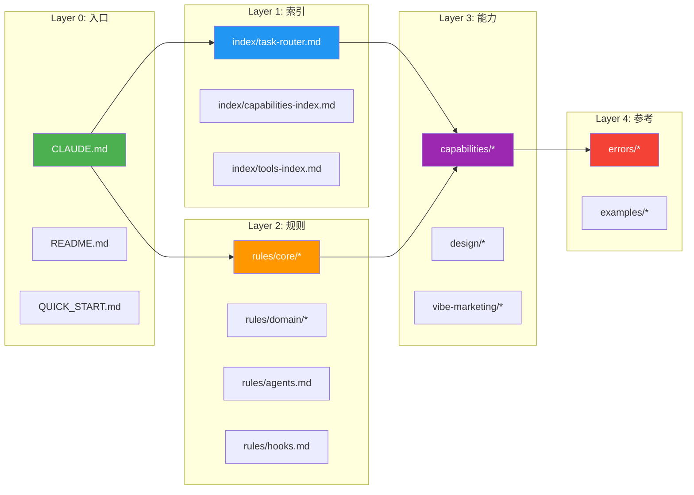
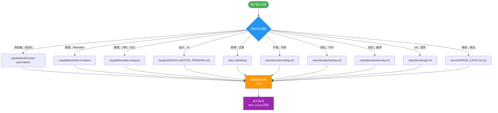
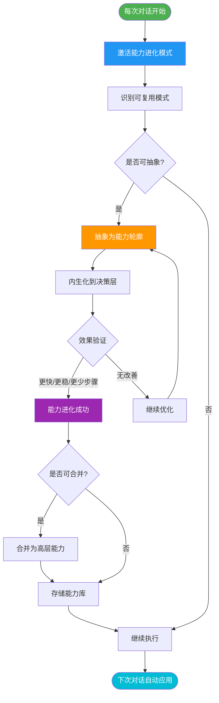
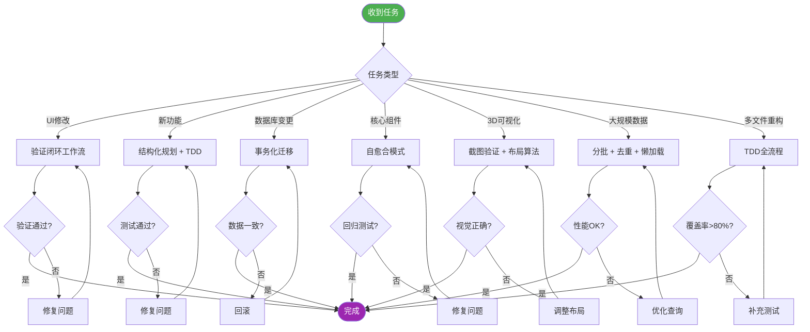
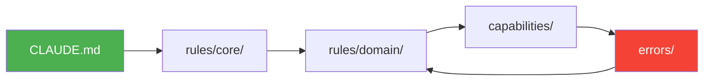

# 知识图谱 (Knowledge Map)

> 文档之间的关系可视化，帮助你快速找到需要的信息

---

## 🗺️ 核心文档关系图

```mermaid
graph TD
    A[CLAUDE.md<br/>核心入口] --> B[CONTEXT_MANAGER.md<br/>智能加载]
    A --> C[rules/core/<br/>核心规则]
    A --> D[rules/domain/<br/>领域规则]
    A --> E[capabilities/<br/>能力库]
    A --> F[errors/<br/>错误库]

    C --> C1[work-mode.md<br/>工作模式]
    C --> C2[blocking-rules.md<br/>阻塞规则]
    C --> C3[capability-evolution.md<br/>能力进化]

    D --> D1[coding.md<br/>编码规范]
    D --> D2[testing.md<br/>测试要求]
    D --> D3[security.md<br/>安全规范]
    D --> D4[git.md<br/>Git工作流]
    D --> D5[engineering-workflows.md<br/>工程化流程]

    E --> E1[browser-automation/<br/>浏览器自动化]
    E --> E2[skills-guide.md<br/>Skills指南]
    E --> E3[plugins-auto.md<br/>Plugins指南]
    E --> E4[mcp-servers.md<br/>MCP服务器]

    F --> F1[top-5-errors.md<br/>Top 5错误]
    F --> F2[ERROR_CATALOG.md<br/>完整错误目录]

    style A fill:#4CAF50,stroke:#2E7D32,stroke-width:3px,color:#fff
    style B fill:#2196F3,stroke:#1565C0,stroke-width:2px,color:#fff
    style C fill:#FF9800,stroke:#E65100,stroke-width:2px,color:#fff
    style D fill:#9C27B0,stroke:#6A1B9A,stroke-width:2px,color:#fff
    style E fill:#00BCD4,stroke:#006064,stroke-width:2px,color:#fff
    style F fill:#F44336,stroke:#C62828,stroke-width:2px,color:#fff
```



---

## 📚 文档层次结构



---

## 🔍 任务路由流程图



---

## 🧬 能力进化流程图



---

## 🔧 工程化工作流触发矩阵



---

## 📖 文档依赖关系

### 核心文档依赖

| 文档 | 依赖文档 | 被依赖次数 |
|------|---------|----------|
| **CLAUDE.md** | 所有其他文档 | 0（入口） |
| **CONTEXT_MANAGER.md** | index/task-router.md | 1 |
| **rules/core/work-mode.md** | CLAUDE.md | 5 |
| **rules/core/blocking-rules.md** | work-mode.md | 3 |
| **rules/domain/coding.md** | core/work-mode.md | 8 |
| **errors/ERROR_CATALOG.md** | top-5-errors.md | 15 |

### 能力文档依赖

| 能力文档 | 依赖规则 | 依赖工具 |
|---------|---------|---------|
| **capabilities/browser-automation/** | coding.md, testing.md | Playwright MCP |
| **capabilities/skills-guide.md** | - | 41 Skills |
| **capabilities/plugins-auto.md** | - | 80 Plugins |
| **design/DESIGN_MASTER_PERSONA.md** | - | Nano Banana Pro |
| **vibe-marketing/** | - | N8N Workflows |

---

## 🔄 循环引用检查



**检查结果**: ✅ 无不合理的循环依赖

---

## 🎯 快速查找路径

### 场景 1: 我想写一个 Playwright 测试

```
路径 1: QUICK_START.md → 示例任务
路径 2: index/task-router.md → capabilities/browser-automation/
路径 3: CLAUDE.md → "浏览器" 关键词 → 自动加载
```

### 场景 2: 遇到异步未并行错误

```
路径 1: errors/top-5-errors.md → E001
路径 2: errors/ERROR_CATALOG.md → E001（完整版）
路径 3: rules/domain/coding.md → Common Patterns
```

### 场景 3: 配置 Git 工作流

```
路径 1: CLAUDE.md → Skills 章节 → /commit
路径 2: rules/domain/git.md → Git Workflow
路径 3: capabilities/skills-guide.md → Git 工作流
```

### 场景 4: 创建 Remotion 视频

```
路径 1: QUICK_START.md → 示例任务
路径 2: capabilities/REMOTION_TEMPLATES_LIBRARY.md → 15个模板
路径 3: examples/project-rules/remotion-auto-production.md → 完整规则
```

---

## 📊 文档统计

| 类别 | 文档数量 | 总行数 | 平均大小 |
|------|---------|-------|---------|
| **核心文档** | 3 | ~800 | ~5KB |
| **索引文档** | 4 | ~2,000 | ~8KB |
| **规则文档** | 9 | ~1,200 | ~3KB |
| **能力文档** | 9 | ~5,000 | ~15KB |
| **错误文档** | 2 | ~800 | ~12KB |
| **设计文档** | 2 | ~2,000 | ~30KB |
| **营销文档** | 3 | ~1,400 | ~18KB |
| **总计** | **40** | **~13,200** | **~10KB** |

---

## 🗂️ 文档更新频率

| 文档 | 更新频率 | 最后更新 |
|------|---------|---------|
| **CLAUDE.md** | 每个大版本 | v5.2 (2026-02-22) |
| **rules/hooks.md** | 每次 Hook 变更 | v2.0 (2026-02-10) |
| **capabilities/skills-guide.md** | 新增 Skill 时 | v2.0 (2026-02-10) |
| **capabilities/plugins-auto.md** | 新增 Plugin 时 | v2.0 (2026-02-10) |
| **errors/ERROR_CATALOG.md** | 发现新错误模式 | v1.0 (2026-01-28) |
| **CHANGELOG.md** | 每次提交 | 持续更新 |

---

## 🔗 相关文档链接

### 快速开始
- [QUICK_START.md](QUICK_START.md) - 5 分钟快速开始
- [README.md](README.md) - 项目概览和架构

### 核心文档
- [CLAUDE.md](CLAUDE.md) - 核心配置入口
- [CONTEXT_MANAGER.md](CONTEXT_MANAGER.md) - 智能加载系统

### 索引系统
- [index/task-router.md](index/task-router.md) - 任务路由决策树
- [index/capabilities-index.md](index/capabilities-index.md) - 能力索引
- [index/tools-index.md](index/tools-index.md) - 工具索引

### 规则系统
- [rules/core/](rules/core/) - 核心规则
- [rules/domain/](rules/domain/) - 领域规则
- [rules/agents.md](rules/agents.md) - Agent 编排
- [rules/hooks.md](rules/hooks.md) - Hooks 系统

### 能力库
- [capabilities/](capabilities/) - 各种能力文档
- [design/](design/) - UI 设计指南
- [vibe-marketing/](vibe-marketing/) - 营销内容

### 错误库
- [errors/top-5-errors.md](errors/top-5-errors.md) - Top 5 错误
- [errors/ERROR_CATALOG.md](errors/ERROR_CATALOG.md) - 完整错误目录

---

**版本**: v1.0
**创建日期**: 2026-02-22
**维护周期**: 每次文档结构变更时更新
